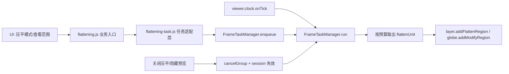

# 压平分帧任务调度系统改造计划

## 一、我的理解

这次要解决的，不是单个 `flattenLayers()` 函数“够不够快”的问题，而是当前压平链路缺少**统一的帧级调度机制**。

结合当前仓库实现，我的理解如下：

- `packages/gis-super-map/src/main.vue` 中，压平模式入口会直接调用 `flatteningMode(this.flattenList, !flage)`。
- `src/core/flatteningManage/flattening.js` 中，`flatteningMode()` 在 KML 分支里会在 `loadKml()` 回调内，立刻对 `areaList` 做整批遍历。
- 这条链路里存在连续的同步重活：
  1. 遍历 `areaList`
  2. 逐面整理 `positionsHeight`
  3. 对每个面调用 `flattenLayers()`
  4. 在 `flattenLayers()` 内再次按图层循环调用 `layer.addFlattenRegion()`
  5. 若启用地形压平，还会继续调用 `viewer.scene.globe.addModifyRegion()`
- 当 KML 中 polygon 很多时，这些操作会在一次回调中扎堆执行，导致单帧阻塞，出现明显假死。

### 关键判断

1. **根因不是 KML 本身，而是“业务循环直接驱动场景写入”**。  
   当前是“拿到业务数据后立即全部落场景”，没有帧预算、没有任务切片、没有取消机制。

2. **问题不只存在于 `flatteningMode()`**。  
   `showFlattenEntity()` 的 KML 预览链路中，同样存在 `areaList.map -> createFlattenEntity()` 的同步堆叠。如果只修压平模式，不处理预览链路，后续仍可能卡。

3. **这个仓库目前没有统一的帧调度基础设施**。  
   现有与帧相关的逻辑分散在：
   - `src/core/fly/keyboardroaming.js` 的 `viewer.clock.onTick`
   - `src/core/popup/popup.js` 的 `viewer.scene.postRender`
   - `src/core/scene/index.js` 的 `viewer.camera.changed`

4. **最合适的落点是 `src/core` 公共层，而不是继续把逻辑堆在压平模块里**。  
   因为这个项目的 `viewer` 是全局单例，初始化入口集中在 `src/core/index.js`，天然适合挂一个全局的帧任务管理器。

---

## 二、本次改造目标

### 必达目标

- SuperMap 每帧只需执行一次统一入口：`FrameTaskManager.run()`。
- 将重型批处理任务拆成可切片任务，按帧预算执行。
- 支持任务分组、取消、暂停、恢复、完成回调、错误隔离。
- 首批接入压平模式与压平预览，避免再次出现“一次点击打一整帧”的问题。
- 后续其他重任务模块可以复用，不再重复造轮子。

### 非目标

- 本阶段**不**重构所有已有工具模块。
- 本阶段**不**改变现有后端接口、业务字段、UI 交互。
- 本阶段**不**把所有 `viewer.scene.*` 操作都收口到调度器中；只优先收拢“批量/高耗时/可切片”的任务。

---

## 三、为当前仓库定制的总体方案

## 1. 新增核心类：`FrameTaskManager`

建议新增目录：`src/core/frame/`

建议首批文件：

- `src/core/frame/FrameTaskManager.js`：核心帧任务管理类
- `src/core/frame/index.js`：初始化与单例访问封装

### 职责定义

`FrameTaskManager` 只做一件事：**把大量同步工作拆开，并在每一帧内按预算执行有限任务**。

它不关心业务名词“压平 / 开挖 / KML / 标绘”，只关心：

- 当前有哪些待执行任务
- 这一帧还能执行多少
- 哪些任务应优先
- 是否需要取消/暂停
- 本帧执行结束后是否还有剩余任务

### 推荐最小能力集

```js
class FrameTaskManager {
  constructor(options) {}
  bindViewer(viewer) {}
  enqueue(task) {}
  enqueueChunked(job) {}
  cancel(taskId) {}
  cancelGroup(groupName) {}
  pauseGroup(groupName) {}
  resumeGroup(groupName) {}
  clear() {}
  run(frameState) {}
}
```

### 任务模型建议

每个任务至少包含：

- `id`：任务唯一标识
- `group`：任务组，如 `flatten-mode`、`flatten-preview`
- `priority`：优先级，如 `high / normal / low`
- `run()`：真正执行一步逻辑
- `isDone()`：是否完成
- `onComplete()`：完成回调
- `onError()`：异常回调
- `cancelled`：取消标记

### 推荐调度策略

采用“双保险”预算：

- **时间预算**：每帧最多占用 $4\sim6ms$（初版建议从 $4ms$ 开始）
- **数量预算**：每帧最多执行固定步数，例如 5~20 步

这样可以避免：

- 单次 API 调用特别重时，单靠数量控制不够
- 单次 API 调用特别轻时，单靠时间控制不稳定

### 为什么推荐挂在 `viewer.clock.onTick`

原因有三点：

1. 当前仓库已经在 `keyboardroaming.js` 中使用 `viewer.clock.onTick` 做持续更新，接入风格一致。
2. `FrameTaskManager` 的职责是“每帧推进任务”，语义上更贴近 `onTick`。
3. `postRender` 更适合依赖屏幕坐标或渲染结果的逻辑（例如 popup 跟随），不适合作为通用批处理入口。

> 结论：**统一调度入口建议使用 `viewer.clock.onTick`**；依赖渲染结果的特殊逻辑仍然保留各自的 `postRender`。

---

## 四、压平模块的接入方式

## 1. 不再让业务循环直接落场景

当前的问题本质上是：

- KML 读出来以后，业务代码直接 `map`
- 业务 `map` 内直接操作 SuperMap 场景对象
- 没有任何中间层做“切片、预算、取消、优先级”控制

改造后应变为三段式：

### 阶段 A：数据准备

将 KML 或 `flattenPositions` 统一转换为标准化任务单元，例如：

```js
{
  flattenId,
  areaIndex,
  positions,
  flattenHeight,
  flattenLayers,
  flattenTerrain
}
```

### 阶段 B：任务入队

把标准化后的单元压入 `FrameTaskManager`，不要立即执行全部压平。

### 阶段 C：按帧执行

由 `FrameTaskManager.run()` 在每一帧内取出若干单元，执行有限次 `layer.addFlattenRegion()` / `globe.addModifyRegion()`。

---

## 2. 压平模块的建议拆分

建议对 `src/core/flatteningManage/flattening.js` 做职责拆分：

### 保留在业务模块中的职责

- 拉取压平列表
- 保存/编辑/删除压平数据
- 组装压平业务参数
- 发起“开启压平 / 关闭压平 / 预览压平”的业务动作

### 下沉到调度层或适配层的职责

- 大数组切片
- 每帧预算控制
- 批任务推进
- 任务取消与覆盖
- 同组任务去重

### 新增一个压平任务适配层（建议）

建议新增：

- `src/core/flatteningManage/flattening-task.js`

职责：

- 将 `flatteningMode()` 和 `showFlattenEntity()` 的业务数据转成调度器可消费的任务
- 屏蔽“当前是 KML 还是坐标串”的差异
- 对外暴露类似：
  - `scheduleFlattenMode(datas)`
  - `scheduleFlattenPreview(data)`
  - `cancelFlattenTasks()`

这样 `flattening.js` 仍然是业务入口，但重型执行路径不再直接写场景。

---

## 五、压平任务的粒度设计

这里是方案是否真正有效的关键。

### 不推荐的粒度

- 一个 KML 文件 = 一个大任务  
  问题：单个任务仍然可能执行过久。

- 一个压平项 = 一个大任务  
  问题：一个压平项内部仍可能包含很多 polygon。

### 推荐的粒度

**一个 polygon 的一次场景写入 = 一个最小任务单元**

也就是：

- 先把 KML 的 `areaList` 拆成多个 polygon 单元
- 每个 polygon 经过高度处理后，形成一个 `flattenUnit`
- 每次只处理有限数量的 `flattenUnit`

这样做的好处是：

- 切片足够细，能真正分散到多帧
- 取消成本低
- 更容易做进度统计
- 更容易在后续加入优先级和动态预算

---

## 六、首批要覆盖的两个高风险入口

### 1. `flatteningMode(datas, enable)`

这是当前最明显的卡顿入口。

改造目标：

- 开启时：不直接整批执行，而是提交 `flatten-mode` 任务组
- 关闭时：先取消 `flatten-mode` 任务组，再统一清空场景中的压平区域

### 2. `showFlattenEntity(data, show, callback)`

这是压平范围预览入口，当前也有大批量 `createFlattenEntity()` 的同步调用。

改造目标：

- `show = true` 时，走 `flatten-preview:{id}` 任务组
- `show = false` 时，直接取消对应预览任务组，并隐藏数据源

> 这一步非常关键。  
> 如果只改压平模式而不改预览链路，用户点击“查看范围”时仍然可能触发大批量同步实体创建。

---

## 七、取消机制与状态一致性设计

当前压平模式还有一个系统层问题：**异步加载与用户关闭操作之间可能发生竞态**。

例如：

1. 用户开启压平模式
2. KML 尚未完全转换/入队
3. 用户马上关闭压平模式
4. 旧任务晚到，继续往场景里写入压平区域

### 解决建议

引入 `sessionToken` / `generation` 机制：

- 每次开启压平模式时，生成新的 `sessionToken`
- 所有该轮任务都带上这个 token
- 关闭压平模式时：
  - 取消对应任务组
  - 使旧 token 失效
  - 清空现有压平区域
- 后续任何旧 token 任务即使到达执行阶段，也要先判定是否已过期

这样才能避免“明明关闭了，旧任务又偷偷写回来”的问题。

---

## 八、推荐的初始化与接入位置

### 1. 初始化位置

建议在 `src/core/index.js` 的 `initSuperMap()` 成功创建 `viewer` 后初始化：

- 创建全局 `FrameTaskManager` 单例
- 绑定到 `viewer.clock.onTick`
- 在 `pitGis` 导出对象中暴露只读获取方法

### 2. 对外访问方式

为了适配当前仓库“全局单 viewer + `pitGis` 统一出口”的风格，建议采用：

- 类负责内部状态
- 模块导出单例 getter

例如：

- `initFrameTaskManager(viewer)`
- `pitGetFrameTaskManager()`

这样既满足“有一个系统的管理类”，又不会破坏现有仓库的使用习惯。

---

## 九、实施阶段建议

## 第一阶段：基础设施落地

目标：先把通用能力搭起来。

输出：

- `FrameTaskManager` 类
- 单例初始化与销毁逻辑
- `run()` 的帧循环绑定
- 基本任务队列、任务组、取消机制、预算机制

验收标准：

- 不接业务时不产生副作用
- 接入后每帧只由调度器入口推进任务
- 可以正确取消一组未完成任务

## 第二阶段：压平模式接入

目标：让 `flatteningMode()` 从“同步批处理”变为“提交分帧任务”。

输出：

- 压平任务适配层
- KML/坐标数据统一成 `flattenUnit`
- 分帧执行 `flattenLayers()`
- 关闭时先 cancel 再 clear

验收标准：

- 大 KML 开启压平时页面仍可交互
- 不再出现单次点击卡死几十秒
- 关闭压平时不会有残留任务回写场景

## 第三阶段：压平预览接入

目标：让 `showFlattenEntity()` 也走统一调度。

输出：

- 预览任务分组 `flatten-preview:{id}`
- 单条预览开关与隐藏逻辑
- 预览任务可取消、可覆盖

验收标准：

- 查看大 KML 范围时不再明显卡顿
- 重复点开/关闭不会堆积旧任务

## 第四阶段：可复用化收尾

目标：让调度器从“为压平服务”提升为“项目基础能力”。

输出：

- 文档说明：适合接入哪些模块
- 后续候选接入点清单
- 公共约束（任务粒度、预算、group 命名、取消规范）

建议下一批候选：

- `src/core/layer/kml.js` 的批量实体处理
- `src/core/tool/modelexcavation.js` 的批量模型操作
- 标绘恢复/批量实体构建链路

---

## 十、验证方案

本次虽然是架构改造，但必须带着验证标准做，不然很容易“看起来很优雅，实际还是一帧打满”。

### 核心验证项

1. **交互连续性**  
   在大 KML 压平开启过程中，地图拖拽、缩放、菜单点击仍能响应。

2. **任务切片有效**  
   单帧内不再连续调用大量 `addFlattenRegion()`。

3. **关闭即时生效**  
   用户关闭压平后，不会再有旧任务继续写入。

4. **重复切换稳定**  
   连续多次开启/关闭，不会出现重复压平、残留区域、任务泄漏。

5. **预览链路一致**  
   查看范围与压平模式都走同一套调度能力，表现一致。

### 建议观察指标

- 首次开启压平时是否仍出现长时间主线程阻塞
- 帧率是否从“瞬时归零”变为“可接受波动”
- 大文件下是否存在明显任务堆积
- 关闭操作到场景完全清理之间的时延是否可接受

---

## 十一、一个很重要的边界提醒

这套方案不是“把 `map` 改成 `for`”或者“套一层 `setTimeout`”那么简单。

如果只是：

- 把 `map` 改 `forEach`
- 在循环里塞 `setTimeout`
- 或者简单包一层 `Promise`

那只是把问题移动了位置，并没有建立**统一、可复用、可取消、可度量**的任务系统。

你这次提出“创建系统管理类，而不是只修一个任务”的方向，我认同，而且这是当前仓库最值得做的做法。

---

## 十二、最终建议结论

我建议这次按下面的原则推进：

1. **先建 `FrameTaskManager`，再接压平，不要反过来。**
2. **压平模式与压平预览一起接入，避免只修一半。**
3. **统一以 `viewer.clock.onTick -> manager.run()` 作为每帧入口。**
4. **按 polygon 拆任务，而不是按文件或按压平项拆粗粒度任务。**
5. **强制支持 group cancel + session token，解决异步竞态。**
6. **把它设计成 `src/core` 的公共基础设施，为后续批量场景操作复用。**

---

## 十三、建议的第一版交付清单

第一版不求一步到位，但要保证骨架正确。建议交付以下内容：

- `FrameTaskManager` 核心类
- 调度器单例初始化与获取方法
- 压平任务适配层
- `flatteningMode()` 分帧化
- `showFlattenEntity()` 分帧化
- 关闭/取消/覆盖机制
- 一份开发说明文档（可追加到本计划后续版本）

---

## 十四、简化后的调用关系图



---

## 十五、补充观察（建议在实现阶段顺手复核）

`showFlattenEntity()` 中的 `createFlattenEntity()` 当前采用的是：

- 先 `viewer.entities.add(...)`
- 再 `dataSource.entities.add(entity)`

这里建议实现时顺手复核实体归属与性能成本，避免在预览链路上出现重复挂载或额外管理开销。

这不是本次计划的主目标，但属于高相关的性能检查点。
