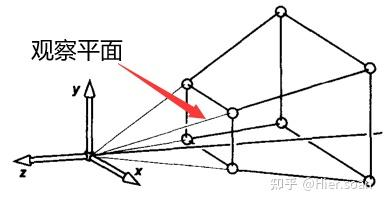

# 投影矩阵的推导

我们知道在观察空间，以摄像机为中心的世界，摄像机其实是不动的（通常默认在原点，看向 -Z 方向）。为了模拟摄像机移动，我们其实是在反向移动整个世界。

在观察空间中观察模型，如图：

## 第一步利用相似三角形推导

如图：

这是一个标准的观察空间，原点是相机，从点 p'处往近平面投影一个点 p，根据相似三角形，可以得出：

$$
\frac{x'}{x_e} = \frac{-n}{z_e} \quad \Rightarrow \quad x' = \frac{n \cdot x_e}{-z_e}
$$

$$
\frac{y'}{y_e} = \frac{-n}{z_e} \quad \Rightarrow \quad y' = \frac{n \cdot y_e}{-z_e}
$$

## 第二步NDC 空间映射

刚才算出的 $x'$ 是投影在近平面上的实际物理尺寸，范围是 $[l, r]$。我们需要把它线性映射到 NDC 的 $[-1, 1]$。

这是一个简单的线性插值问题 $x_{ndc} = A \cdot x' + B$。

-   当 $x' = l$ 时，$x_{ndc} = -1$
-   当 $x' = r$ 时，$x_{ndc} = 1$

解这个二元一次方程组：

$$
\begin{cases}
A \cdot l + B = -1 \\
A \cdot r + B = 1
\end{cases}
$$

相减得 $A(r - l) = 2 \Rightarrow A = \frac{2}{r - l}$。
代入得 $B = -\frac{r + l}{r - l}$。

所以：

$$
x_{ndc} = \frac{2}{r-l}x' - \frac{r+l}{r-l}
$$

将第一步中的 $x' = \frac{n \cdot x_e}{-z_e}$ 代入上式：

$$
x_{ndc} = \frac{2}{r-l}(\frac{n \cdot x_e}{-z_e}) - \frac{r+l}{r-l}
$$

两边同乘 $-z_e$（也就是 $w_c$），得到裁剪空间坐标 $x_c$：

$$
x_c = x_{ndc} \cdot (-z_e) = \frac{2n}{r-l}x_e + \frac{r+l}{r-l}z_e
$$

**同理可得 $y_c$：**

$$
y_c = \frac{2n}{t-b}y_e + \frac{t+b}{t-b}z_e
$$

## 第三步：最复杂的 Z 轴处理

为什么 Z 轴复杂？因为 $x$ 和 $y$ 是为了投影到屏幕平面上，而 $z$ 是为了保留深度信息做深度测试（Depth Test）。
我们需要把观察空间的 $z_e$（范围 $[-n, -f]$）映射到 NDC 的 $z_{ndc}$（范围 $[-1, 1]$）。

**注意：** $z_{ndc}$ 必须跟 $x$ 和 $y$ 无关，只跟 $z$ 和 $w$ 有关。所以我们可以假设 $z_c$ 的构建公式为：
$$
z_c = A \cdot z_e + B \cdot w_e \quad (\text{已知 } w_e = 1)
$$
也就是：
$$
z_c = A \cdot z_e + B
$$

由于最终 $z_{ndc} = \frac{z_c}{w_c} = \frac{z_c}{-z_e}$，所以：
$$
z_{ndc} = \frac{A \cdot z_e + B}{-z_e}
$$

我们需要满足边界条件（WebGL 中 NDC Z 范围是 -1 到 1）：
1.  **近平面：** 当 $z_e = -n$ 时，$z_{ndc} = -1$
2.  **远平面：** 当 $z_e = -f$ 时，$z_{ndc} = 1$

代入方程组：
1.  $-1 = \frac{A(-n) + B}{-(-n)} \Rightarrow -1 = \frac{-An + B}{n} \Rightarrow -n = -An + B$
2.  $1 = \frac{A(-f) + B}{-(-f)} \Rightarrow 1 = \frac{-Af + B}{f} \Rightarrow f = -Af + B$

解方程组：
由 (1) 得 $B = An - n$。代入 (2)：
$$ f = -Af + (An - n) $$
$$ f + n = A(n - f) $$
$$ A = \frac{f + n}{n - f} = -\frac{f + n}{f - n} $$

求 B：
$$ B = A n - n = -\frac{f+n}{f-n}n - n = \frac{-fn - n^2 - (nf - n^2)}{f-n} = \frac{-2fn}{f-n} $$

所以：
$$
z_c = -\frac{f+n}{f-n}z_e - \frac{2fn}{f-n}w_e
$$

---

## 第四步：W 分量的处理

这一步最简单。我们要实现 $w_c = -z_e$。
观察空间 $P_e = (x_e, y_e, z_e, 1)$。
所以矩阵的最后一行应该是 $(0, 0, -1, 0)$。

---

## 第五步：组装矩阵

现在我们将上面的公式填入 $4 \times 4$ 矩阵。
*   $x_c$ 系数填第一行。
*   $y_c$ 系数填第二行。
*   $z_c$ 系数填第三行。
*   $w_c$ 系数填第四行。

$$
M_{proj} = \begin{bmatrix}
\frac{2n}{r-l} & 0 & \frac{r+l}{r-l} & 0 \\
0 & \frac{2n}{t-b} & \frac{t+b}{t-b} & 0 \\
0 & 0 & -\frac{f+n}{f-n} & -\frac{2fn}{f-n} \\
0 & 0 & -1 & 0
\end{bmatrix}
$$

## 简化版（对称视锥体）

在实际开发中，我们通常使用 `gluPerspective(fov, aspect, near, far)`，此时视锥体是对称的。
也就是 $r = -l$， $t = -b$。
这意味着 $r+l = 0$，$t+b = 0$。
且 $r-l = width$，$t-b = height$。

矩阵会简化为最常见的形态：

$$
M_{symmetric} = \begin{bmatrix}
\frac{2n}{width} & 0 & 0 & 0 \\
0 & \frac{2n}{height} & 0 & 0 \\
0 & 0 & -\frac{f+n}{f-n} & -\frac{2fn}{f-n} \\
0 & 0 & -1 & 0
\end{bmatrix}
$$

如果再用 FOV（视野角度）来表示，因为 $\tan(fov/2) = \frac{height/2}{n}$，所以 $\frac{2n}{height} = \frac{1}{\tan(fov/2)}$。

最终代码里常见的矩阵：
$$
\begin{bmatrix}
\frac{1}{aspect \cdot \tan(fov/2)} & 0 & 0 & 0 \\
0 & \frac{1}{\tan(fov/2)} & 0 & 0 \\
0 & 0 & -\frac{f+n}{f-n} & -\frac{2fn}{f-n} \\
0 & 0 & -1 & 0
\end{bmatrix}
$$

---
